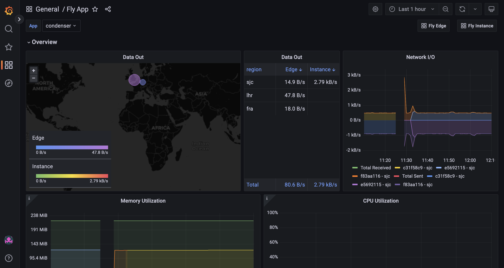

# Condenser

Welcome to Condenser, a url shortening application! A live prototype of this application can be found at https://condenser.sh

## Setup 

Tools Needed:
  - `asdf`
  - `docker`

I use `asdf` as my local language runtime vm. If you don't use it I highly recommend it, on a mac system just run: 

```bash
brew install asdf
```

From the root of the directory, all you have should have to do is run: 

```bash
asdf install
```

This will install the proper elixir/erlang versions from `.tool-versions`. If this is your first time using `asdf`, you will have to first add the elixir/erlang plugins to via: 

```bash
asdf plugin-add $language
```

The next order of business is setting up your postgres container that will be the backend of this system. If you already have `docker` installed you should just be able to run the below command from the root of this directory and you'll be good to go:

```bash
docker compose up
```


After the postgres container is running you'll be able to run:  

```bash
mix setup
```

This will grab the project dependencies and setup the postgres backend.

Then you should be able to start the application locally using: 
```bash
mix phx.server
``` 

You can test the application using:

```bash
mix test
```

## Project Notes

### Assumptions

- I'm using Phoenix 1.7-rc for this prototype
- To keep stats queries on the lighter side, I configured the results to be limited to 100 rows _(this value is configurable in `runtime.exs -> :top_hits_limit`)_
- Slug length is 6 chars long and uses Base64 URL safe characters _(this value is also configurable in `runtime.exs -> :short_slug_length: 6`)_ - this leads to a max of 64^6 (~69bn short urls).
- CSVs are generated in and served from `/priv`
- Not concerned with client unique urls - that is if two different clients type in the same long url, they should both receive the same short url

### Overview

A user heads to the home page and enters a "long url". 


When the form is submitted, the URL is validated and cross-checked against existing long urls in the database. After this validation step the new long url is run through a hashing function - the provided URL is hashed to SHA256 which is then Base64 URL encoded. The idea here is that we try to hash long URLs in a consistent manner, opposed to just randomly generating characters which could rely on system state. Using this method, there's an extremely small chance of collisions, but there's a built in fail over in case a collision occurs when generating a "short slug". From the generated hash, a 6 character long window (short slug) slides through the hash and tries inserting the short slugs until one is successful. As an example, the shortest valid url `https://a.a` returns a long hash of `"VmSdPVhSbqAMyoPtKkCIC0rl_zfaKBbUuHxw1HQ8wug"` which is 43 characters long, giving us `43 - (6-1) = 38` possible short slugs to try inserting before ultimately failing. If we exhaust all of those options, an error is raised. 


If we continued down the defensive programming path, there are other options like rehashing the long hash and trying again, but running into this many collisions in such a consistent manner means our application is near or at its limit and we should consider tacking on a character to the slugs - which we can do via the runtime config.

On the stats side, I decided to go with a client access history table for the `/stats` endpoint. It's slower on the aggregation side, but I have a feeling this is more of an admin tool and we'd rather sacrifice some speed here than on the user side where we'd either have to manually increment the field which leads to race conditions or set up some other queue for post-redirect increments which is a bit overkill. There's an aggregation query for the `/stats` endpoint that grabs the top 100 most visited shortened urls. When a user clicks on the download button, a csv is generated of the top hits and put in their browser download folder.


### App Layout

```
condenser
|-- assets - Front-end assets (CSS, JS, Phoenix)
|-- config - Application configs, configurable runtime vars located in `runtime.exs`
|-- deps - Pulled in deps from hex
|-- lib 
  |-- condenser - all of the backend db code lives here
  |-- condenser_web - all the front-end code lives here (router, controllers, templates, etc.)
|-- priv - mainly care about db migration files and csvs get generated in the csvs subdirectory
|-- test - all of the backend and frontend tests live here in a mirror of above lib structure
```

### DB

I used a Postgres backend for this application because of its relative ease to get up and running and its ease of deployability. I was initially thinking of using SQLite + LiteFS (with knowledge of deploying to Fly), for it's lightning quick reads, but the major drawback is only having access to one write thread which could become a bottleneck for an application like this.

There are two tables in this app: `urls` and `access_history`. The `urls` table is the table used for mapping "long urls" to "short urls". This is the core of the application which is used for inserting new mappings, doing lookups for redirects and lookups for existing entries. The second table, `access_history`, is used to record whenever a short url is used. It has a foreign key that points to `urls` so that we can keep the data slim and normalized, and other than that just records the ip of the client that was accessing the short url.

### APIs

- `GET /` : renders the home page HTML 

- `GET /:short_slug` : using the short slug param, looks up whether that short slug exists. If the short slug exists, redirect to the long url, otherwise redirect to the home page and flash an error.

- `POST /s/shorten` : used by the form on the home page, given a `"long_url"` param. First checks whether the given url already exists in the db, if it does return corresponding short url. If it doesn't already exist, try generating and inserting a short slug - if successful show the short url, otherwise redirect to home screen and flash error.

- `GET /s/stats` : runs an aggregation of the client access history and generates data needed to render stats table on front end.

- `GET /s/csv` : runs aggregation of the client access history and generates a csv of the data. If hitting via client the data will automatically download, if using raw endpoint data will be in response body. 

### Testing

All of the backend functions were tested and their corresponding tests are located in `test/condenser`. I paid extra attention to testing url validity, the backbone of this is actually Elixir's built in `URI` parser which is quite robust. The tests for the controllers are located in `test/condenser_web`. Since the backend code was quite thoroughly tested, most of the controller tests focus around happy path scenarios to quickly identify regressions. The tests can be run using the `mix test` command from the root of the project directory.

### Scalability

Even though this app is very lightweight, this is a db heavy app and all of the business logic lives in one table.

The front end should be able to scale fine by adding more app replicas, but the more problematic area is the backend db. One way to tackle this would be to partition on short link hash along with linearly scaling compute/storage size for the db. Since we have a consistent way of hashing long urls to short urls we can tweak the code to have a separate hash function that first hashes to a short link and checks whether that exists, then everything is driven through short url hashes. If we're also concerned with the availability, then it could also be time to start exploring other options like CockroachDB serverless which would handle a lot of the scaling logic for us and is generally built to handle higher/more available loads.

In lockstep with the above, to help protect against the above we could introduce policies that automatically delete unused or old links after X amount of time to reclaim db space and speed up queries. We'd also have to let users know about this policy change on the front end as well. We would also want to run pre-aggregations of the `/stats` data at set time intervals instead of aggregating _every_ time a user makes a request.

### Resiliency & Availability

The app itself has good error handling to ensure a smooth user experience. Instead of flashing errors for users, I try to take steps to actively remedy errors before presenting them to users (mainly in the short url generation code). If this app was to be deployed to a production environment, there would have to be some extra attention paid to resiliency. In the current implementation, it is possible to overload the server by repeatedly requesting CSVs - ideally this should be hiding behind some sort of auth mechanism so only those with admin access can download CSVs and/or be storing CSVs external to the app server. 

In the prototype deploy, this app was deployed using Fly.io, which has a lot of nice built ins for availability. Deploying using Fly.io makes it extremely easy to add more app replicas in regions close to your users so that you can ensure high availability at all times. There is also built in Grafana monitoring and health checks to help ensure availability and monitor any errors.



### Future Enhancements

- Implement login and security for `/stats`
- Pagination for stats, right now just limited to 100 (but still configurable)
- Introduce time window filters for stats (daily, monthly, yearly top hits)
- Run aggregations for `/stats` based on predefined time intervals (daily) to help reduce db load
- Move the csv storage to somewhere external like S3
- Rate limiting (especially for csvs)

